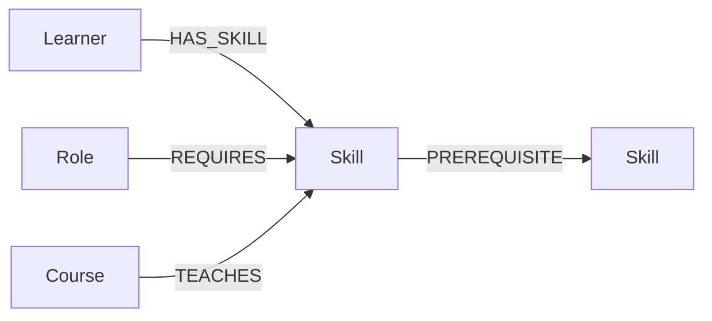

# SkillPath — Graph-Powered Learning & Career Explorer

A small Java/Spring Boot web application built for the Wexa AI CognoDB take-home assignment. SkillPath models learners, skills, courses, prerequisites and target roles as a graph, then traverses those relationships to explain skill gaps and learning paths.

## Why this use case?

A conventional LMS often stores learner skills, course catalogues and role requirements in separate tables. The interesting questions here are relationship-heavy:

- What skills is a learner missing for a target role?
- Which courses teach those missing skills?
- What prerequisite chain connects the learner's existing skills to a target skill?
- Which skills are shared across multiple career paths?

These are natural graph traversals. The graph keeps the relationships explicit rather than requiring multiple joins and application-side stitching.

## Graph model



### Nodes

| Label | Important properties |
|---|---|
| `Learner` | `id`, `name` |
| `Skill` | `id`, `name`, `priority` |
| `Course` | `id`, `name`, `level` |
| `Role` | `id`, `name` |

### Relationships

- `Learner -[:HAS_SKILL]-> Skill`
- `Role -[:REQUIRES]-> Skill`
- `Course -[:TEACHES]-> Skill`
- `Skill -[:PREREQUISITE]-> Skill`

## Architecture

```text
Browser / Thymeleaf UI
        |
        v
Spring MVC Controller
        |
        v
GraphService
        |
        v
GraphRepository
        |
        v
Official Neo4j Java Driver
        |
        v
CognoDB (Bolt / openCypher)
```

The repository contains all Cypher strings in one place and uses parameter maps for runtime values. Database credentials are read only from environment variables.

## Requirements covered

- Thoughtful labeled graph data model and typed relationships.
- Realistic seed data loaded by a Java seed endpoint.
- Multi-hop traversal using `[:PREREQUISITE*1..5]` and `shortestPath`.
- Graph-native query for missing role skills + courses that teach them.
- Parameterised Cypher through the official Neo4j Java driver.
- Functional web UI with loading/error/empty states.
- Environment-based CognoDB connection details.
- Graceful database error handling and `/health` endpoint.
- Main queries documented in `src/main/resources/cypher/queries.cypher`.

## Technology

- Java 17+
- Spring Boot 3.5
- Spring MVC + Thymeleaf
- Official Neo4j Java Driver 6.1.x
- CognoDB over Bolt
- Gradle

The current Neo4j Java Driver documentation lists the official Gradle dependency and states that the 6.x driver requires Java 17+; it also recommends a shared thread-safe `Driver` instance. This project follows that model.

## Run locally

### 1. Create CognoDB

Create a free CognoDB instance from the CognoDB console. Copy the Bolt URI and password immediately because the assignment states the generated password is shown once.

### 2. Configure environment variables

Linux/macOS:

```bash
export COGNODB_URI='bolt+s://<instance-id>.databases.cognodb.cloud'
export COGNODB_USERNAME='cognodb'
export COGNODB_PASSWORD='<your-password>'
export COGNODB_DATABASE='neo4j'
```

Windows PowerShell:

```powershell
$env:COGNODB_URI='bolt+s://<instance-id>.databases.cognodb.cloud'
$env:COGNODB_USERNAME='cognodb'
$env:COGNODB_PASSWORD='<your-password>'
$env:COGNODB_DATABASE='neo4j'
```

Never commit the password or `.env` file.

### 3. Start the application

If Gradle is installed globally:

```bash
gradle clean test
gradle bootRun
```

Or, after generating the Gradle Wrapper once:

```bash
./gradlew clean test
./gradlew bootRun
```

Windows PowerShell:

```powershell
gradle clean test
gradle bootRun
```

The packaged executable JAR is created with:

```bash
gradle clean bootJar -x test
```

The JAR will be under `build/libs/skillpath-1.0.0.jar`.

Open `http://localhost:8084`.

### 4. Load seed data

After the application starts:

```bash
curl -X POST http://localhost:8084/admin/seed
```

Then refresh the UI.

## Main flow

1. Select a learner.
2. Select a target role.
3. SkillPath traverses `Learner -> Skill` and `Role -> Skill` to calculate missing skills.
4. It traverses `Course -> Skill` to find courses teaching each missing skill.
5. The UI can request a multi-hop prerequisite path using `Skill -> PREREQUISITE -> Skill`.

## Example graph questions

### Multi-hop prerequisite traversal

```cypher
MATCH (l:Learner {id: $learnerId})-[:HAS_SKILL]->(start:Skill)
MATCH (r:Role {id: $roleId})-[:REQUIRES]->(target:Skill)
WHERE NOT (l)-[:HAS_SKILL]->(target)
MATCH path = shortestPath((start)-[:PREREQUISITE*1..5]->(target))
RETURN [n IN nodes(path) | n.name] AS learningPath
LIMIT 5;
```

### A query that is awkward in a relational model

```cypher
MATCH (l:Learner {id: $learnerId})-[:HAS_SKILL]->(have:Skill)
MATCH (role:Role {id: $roleId})-[:REQUIRES]->(needed:Skill)
WHERE NOT (l)-[:HAS_SKILL]->(needed)
OPTIONAL MATCH (course:Course)-[:TEACHES]->(needed)
RETURN needed.name, collect(course.name);
```

The value is not just retrieving a row; it is following a connected subgraph across learner state, role requirements, skills and course coverage in one traversal.

## Seed data

The seed contains two learners, two roles, nine skills and nine courses, with prerequisite and teaching relationships. The Java implementation is in `GraphRepository.seed()` and is idempotent because it uses `MERGE`.

## Error handling

If CognoDB is unavailable, the UI remains usable enough to display a clear connection error instead of exposing a stack trace. `/health` returns HTTP 503 when connectivity verification fails.

## Security notes

- Credentials are environment variables only.
- No password is stored in source control.
- Cypher uses `$learnerId` / `$roleId` parameters rather than concatenating user input.
- `.gitignore` excludes local environment files.

## Suggested demo recording

1. Show the home screen and connected status.
2. Choose `Asha` + `Java Backend Engineer`.
3. Explain the readiness count and missing skills.
4. Show recommended courses.
5. Click **Show multi-hop learning paths** and explain how the graph traverses prerequisite relationships.
6. Briefly show the README model and the parameterised Cypher query.

## Submission checklist

- [ ] Push source code to GitHub.
- [ ] Do not commit CognoDB password.
- [ ] Add screenshots to README.
- [ ] Deploy the application to a free hosting provider if possible.
- [ ] Record a short end-to-end demo.
- [ ] Email repository + demo link to `hr@wexa.ai` with subject `CognoDB Assignment 2 – <Your Name>`.
